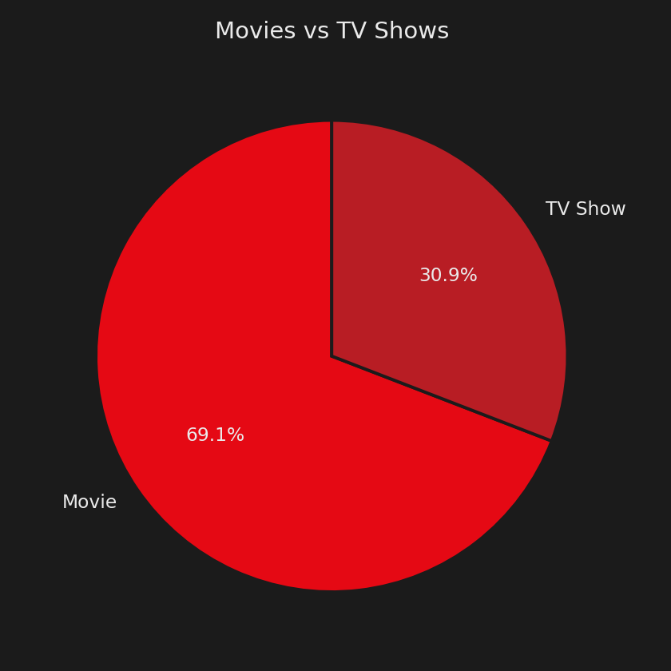
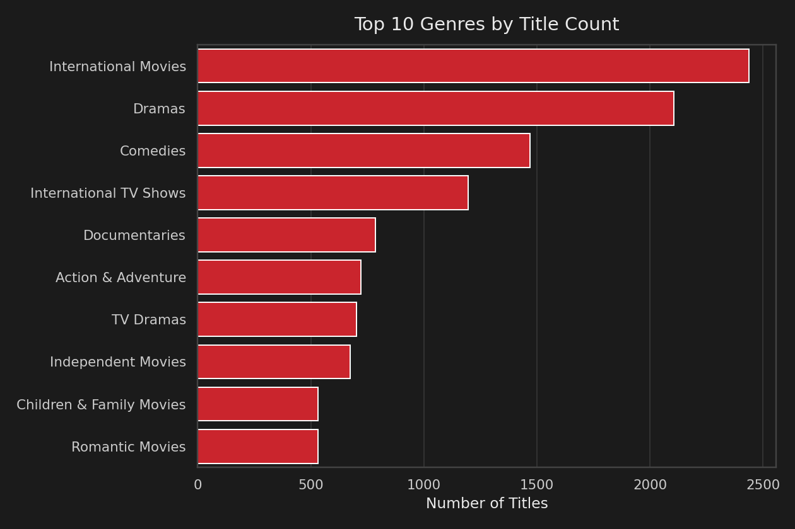
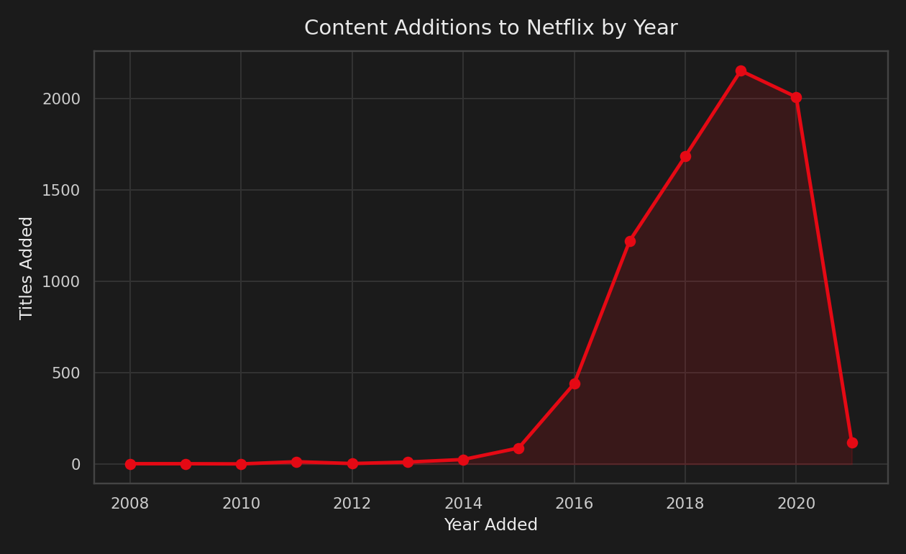
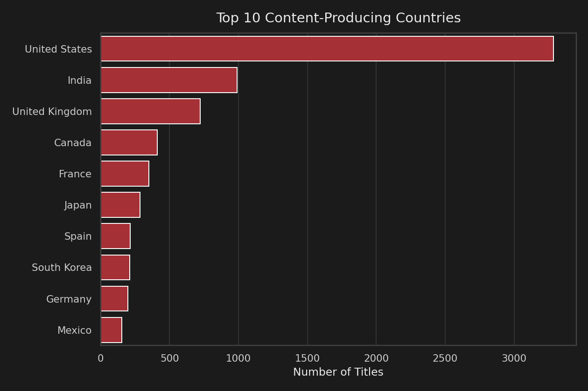
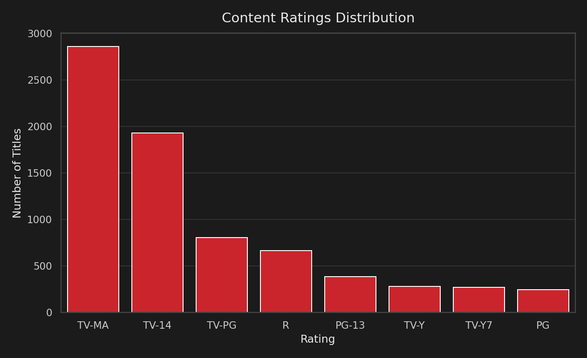
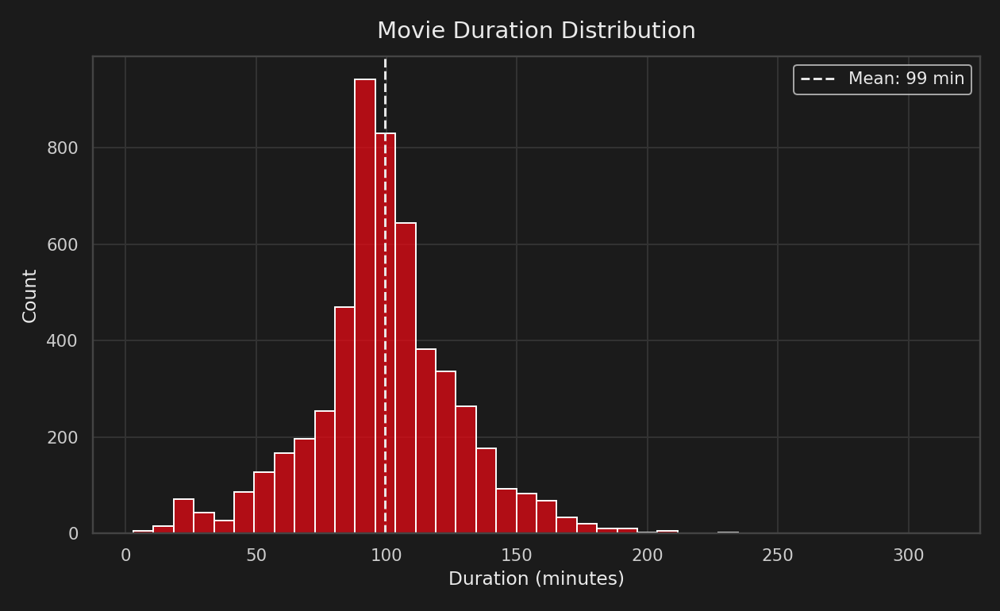

# 🎬 Netflix Movies & TV Shows — Exploratory Data Analysis

Exploratory Data Analysis (EDA) on Netflix's public content catalog to uncover trends in genre popularity, content additions over time, and country-wise distribution of titles.

[](https://colab.research.google.com/github/Baji-Shaida/Netflix-Data-Analytics/blob/main/Netflix_EDA.ipynb)
[](LICENSE)

## Objective

Understand how Netflix's content library has grown and evolved — what kinds of content dominate, where it comes from, and how additions have trended over time — using Python's data analysis and visualization stack.

## Dataset

- **Source:** Netflix Movies and TV Shows dataset (originally published on Kaggle, distributed via [TidyTuesday](https://github.com/rfordatascience/tidytuesday/blob/main/data/2021/2021-04-20/readme.md))
- **Size:** 7,787 titles, 12 original columns (`type`, `title`, `director`, `cast`, `country`, `date_added`, `release_year`, `rating`, `duration`, `listed_in`, `description`)

## Tools & Libraries

- Python
- Pandas — data cleaning & transformation
- Matplotlib & Seaborn — data visualization
- Jupyter Notebook

## Project Workflow

1. **Data Loading & Inspection** — reviewed structure, data types, and missing values
2. **Data Cleaning** — filled missing `country`, `director`, `cast` with `"Unknown"`; dropped the small number of rows missing `date_added` or `rating`; converted `date_added` to datetime and engineered `year_added` / `month_added` features
3. **Data Transformation** — exploded multi-valued `listed_in` (genre) and `country` fields for granular, per-genre and per-country analysis
4. **Exploratory Analysis**
   - Movies vs TV Shows split
   - Top 10 genres by title count
   - Content additions by year
   - Top 10 content-producing countries
   - Content ratings distribution
   - Movie duration distribution
5. **Insights & Takeaways** — summarized key findings from each analysis

## Key Findings

| Chart | Insight |
|---|---|
|  | Movies make up **69.1%** of the catalog vs. **30.9%** TV Shows. |
|  | **International Movies**, **Dramas**, and **Comedies** are the most common genres. |
|  | Content additions peaked in **2019** (2,153 titles) before declining sharply in 2020–2021. |
|  | The **United States** (3,287 titles) and **India** (990 titles) lead content production by a wide margin. |
|  | **TV-MA** and **TV-14** are the most common ratings, together covering more than half the catalog. |
|  | Average movie duration is approximately **99 minutes**. |

## Repository Structure

```
Netflix-Data-Analytics/
├── Netflix_EDA.ipynb        # Main analysis notebook (outputs included)
├── netflix_titles.csv       # Dataset
├── charts/                  # Exported visualizations (embedded above)
├── requirements.txt         # Python dependencies
├── LICENSE
└── README.md
```

## How to Run

```bash
git clone https://github.com/Baji-Shaida/Netflix-Data-Analytics.git
cd Netflix-Data-Analytics
pip install -r requirements.txt
jupyter notebook Netflix_EDA.ipynb
```

Or click **"Open in Colab"** above to run it in your browser with no setup.

## Author

**Shaik Baji Shaida** — [LinkedIn](https://www.linkedin.com/in/bajishaida/) | [GitHub](https://github.com/Baji-Shaida)
